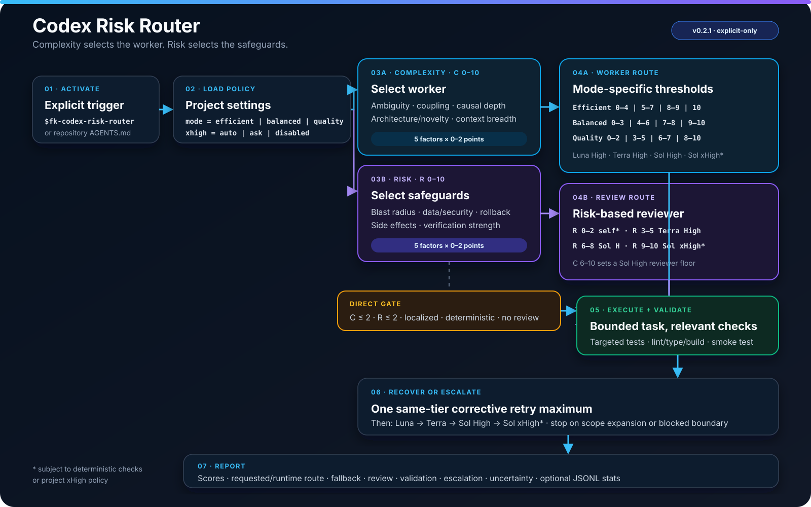

# FK Router

[](./SKILL.md)
[](./agents/openai.yaml)

A Codex skill with GPT-6 Astra High for coordination, project leadership, audits and review. Implementation workers use GPT-5.6 Luna, Terra, Sol or GPT-6 Astra according to task complexity and project policy. Risk determines safeguards and whether independent review is required.

The goal is lower total workflow cost, including context transfer, retries and review. Routing thresholds are heuristics; savings and quality improvements are not benchmark-proven.

<p align="center">
  
</p>

## Efficiency update: v0.3.2

- No over-engineering: keep architecture, dependencies, agents, documentation and verification proportionate to the real task and risk. Prefer the simplest complete, reliable solution, not speculative future-proofing or maximum process.
- Discover enough to choose the worker; do not solve the task twice. Keep substantial diagnosis and authorized implementation with one capable owner.
- Reuse the task contract and route; follow-ups transfer changed facts and failure evidence, not full history.
- Reuse checks tied to the unchanged revision/environment. Independent review still inspects the diff/source; optional polish does not cause repair loops.
- Let the coordinator review when genuinely independent; use a separate reviewer when it authored the implementation or detailed solution.
- Load policy and logging details only when applicable. Evaluate savings using whole-workflow usage and accepted outcomes, not cheap worker calls alone.

An accepted native model/effort request with no effective metadata may satisfy role selection as `accepted_unverified`, unless confirmed identity is explicitly required. It is never reported as confirmed. Missing accepted selection, known mismatch or unavailable required roles remain blockers; successful task acceptance still requires completed checks and review.

These changes reduce avoidable process work; decision simulations and structural checks do not establish production token savings.

## Routing contract

| Stage | Decision |
|---|---|
| Activation | Explicit `$codex-risk-router` request or applicable `AGENTS.md` instruction. A policy file alone does not activate the skill. |
| Leadership | One Astra High coordinator. No substitute for unavailable leadership or review. |
| Project policy | Preserve `.codex/risk-router.toml` and unknown keys. Without a policy, use task-local defaults and create no project files. |
| Complexity | Score ambiguity, coupling, causal depth, architecture/novelty and context breadth, each 0–2. |
| Risk | Score blast radius, data/security, reversibility, side effects and verification, each 0–2. |
| Execution | Eligible micro-task: `direct`. Matching worker session: `current`. Otherwise `delegated`, or permitted `fallback_current` when controls are unavailable. |
| Safeguards | Validate results; required model-based audits and reviews use Astra High. |
| Recovery | At most one same-route correction and three implementation attempts total per bounded objective, including model switches. |
| Reporting | Separate requested and confirmed runtime models for coordinator, worker and reviewer. Only the parent writes optional JSONL statistics. |

## Implementation worker selection

`C` is the 0–10 complexity score. Apply policy ceilings and the execution gate after initial selection.

| Mode | Luna | Terra | Sol | Astra |
|---|---|---|---|---|
| Efficient | C 0–4 | C 5–7 | C 8–9 | C 10 |
| Balanced | C 0–3 | C 4–6 | C 7–8 | C 9–10 |
| Quality | C 0–2 | C 3–5 | C 6–7 | C 8–10 |

Luna stays High. Terra, Sol and Astra implementation workers use Medium or High according to the conditions in [SKILL.md](./SKILL.md); xHigh needs a concrete reasoning need and policy permission. No automatic Max or Ultra.

Direct execution requires all of: C ≤ 2, R ≤ 2, a localized micro-task, deterministic validation, no independent-review need and obvious delegation overhead. Substantial work cannot remain with a more expensive model merely because it is capable.

## Leadership and review

Coordination, project leadership, audits and review always use `gpt-6-astra` with exactly `high` reasoning. These roles do not require separate agents for every title. An implementer cannot approve its own work as an independent review.

| Risk | Independent review |
|---|---|
| R 0–2 | No separate reviewer when deterministic checks pass; otherwise Astra High |
| R 3–10 | Astra High |

If required Astra High leadership or review cannot run, that phase is blocked. A skill cannot itself switch the running model; the client must expose permitted controls or the user must select the required setting. An accepted override without effective metadata remains unverified.

## Project policy

Existing schema `version = 1` remains supported:

```toml
version = 1
mode = "balanced" # efficient | balanced | quality
xhigh = "ask"     # implementation workers: auto | ask | disabled
stats = true
astra = "auto"    # Astra implementation workers: auto | ask | disabled
```

`astra` controls workers, not the fixed Astra High leadership/review requirement. Missing `astra` defaults to `auto`, except legacy `xhigh = "disabled"` without `astra` preserves a Sol High worker ceiling. Binding user budget/access restrictions still apply to all roles.

Without a policy, defaults are balanced, xHigh ask, Astra auto and statistics off. Persist settings and add the following project instruction only when project setup is requested or already authorized:

```text
For coding tasks in this repository, use $codex-risk-router and follow .codex/risk-router.toml.
```

## Install and update

Personal installation:

```bash
git clone https://github.com/paraxs/fk-codex-risk-router.git "$HOME/.agents/skills/codex-risk-router"
```

Repository-scoped installation:

```bash
git clone https://github.com/paraxs/fk-codex-risk-router.git .agents/skills/codex-risk-router
```

The repository name remains `fk-codex-risk-router`; the v0.3.1 skill name and invocation are `codex-risk-router`. When upgrading v0.2.1, update existing `$fk-codex-risk-router` project references to `$codex-risk-router` and retain only one installed copy. Preserve project policy and logs. Back up local modifications before replacing an existing installation.

For an unmodified Git installation, update with `git pull --ff-only` from the skill directory. ZIP installations require replacing the skill files. Publishing an update on GitHub does not update existing local copies automatically.

Invoke with:

```text
$codex-risk-router implement the requested coding change
```

If the updated skill does not appear, restart Codex. See [official skill documentation](https://learn.chatgpt.com/docs/build-skills) for discovery and invocation.

## Files

```text
codex-risk-router/
├── SKILL.md
├── agents/openai.yaml
├── references/
│   ├── model-notes.md
│   ├── project-policy.md
│   └── statistics.md
├── assets/icon.svg
└── docs/risk-router-flow.svg
```

The model reference separates documented capabilities from FK policy. The skill adds no orchestration service, custom model-pinned agent TOMLs, database, dashboard or nested agent hierarchy.
